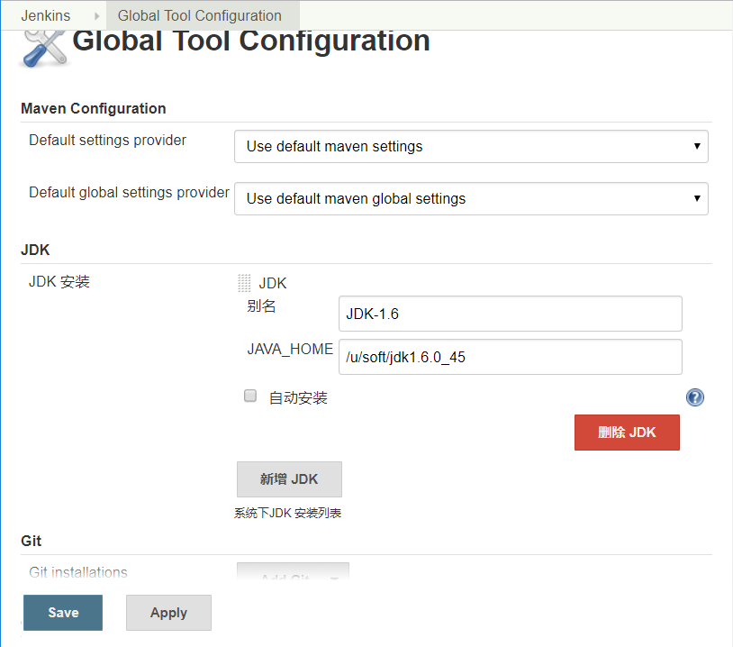
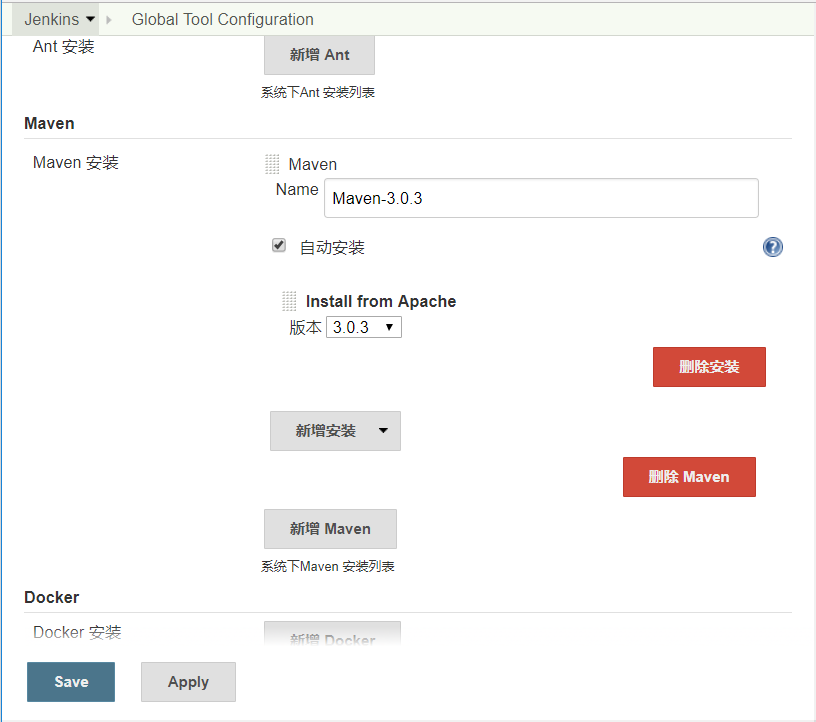
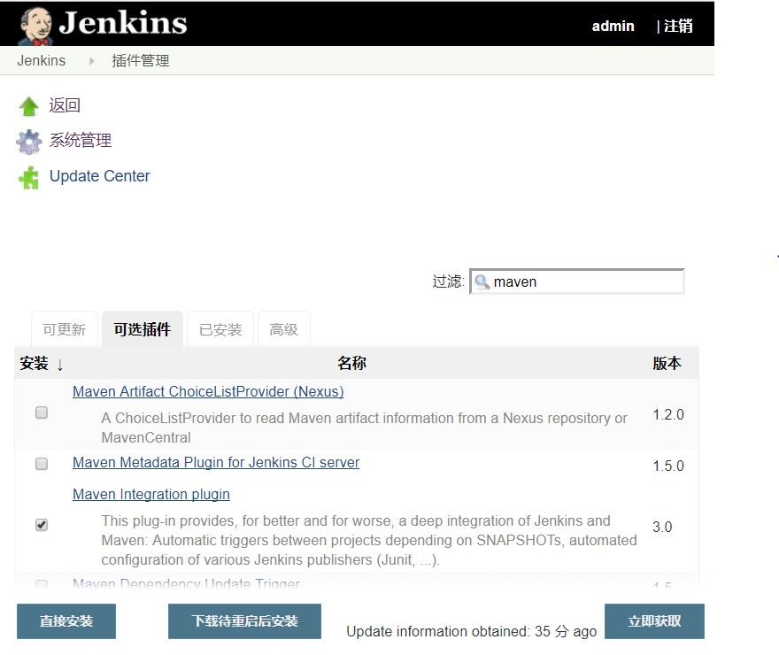
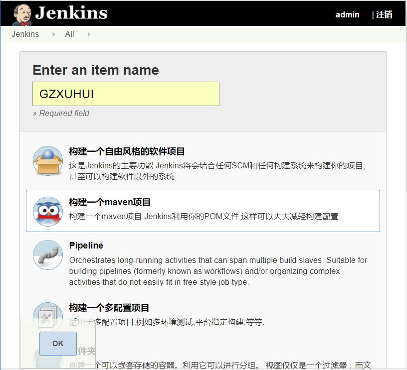
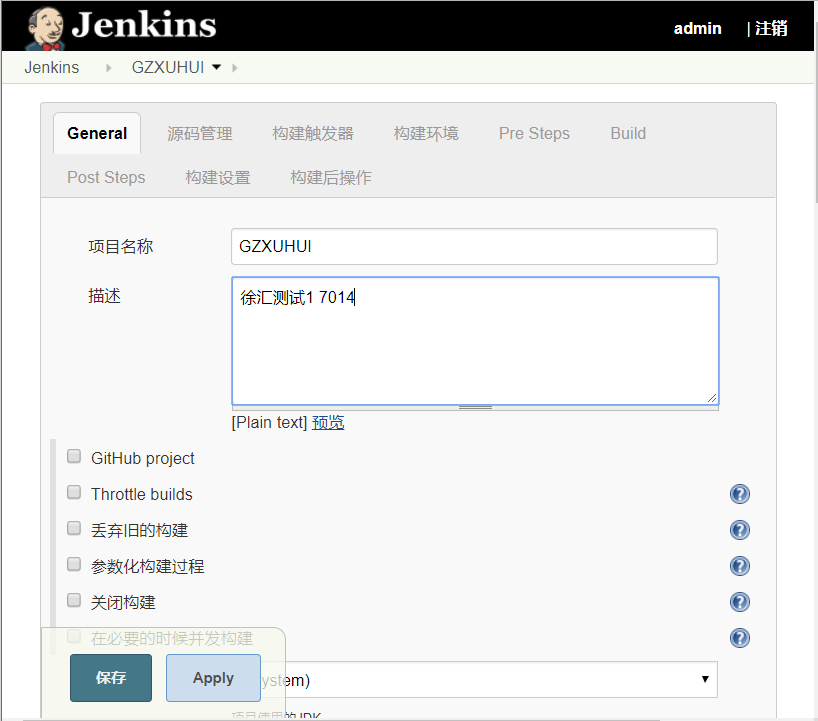
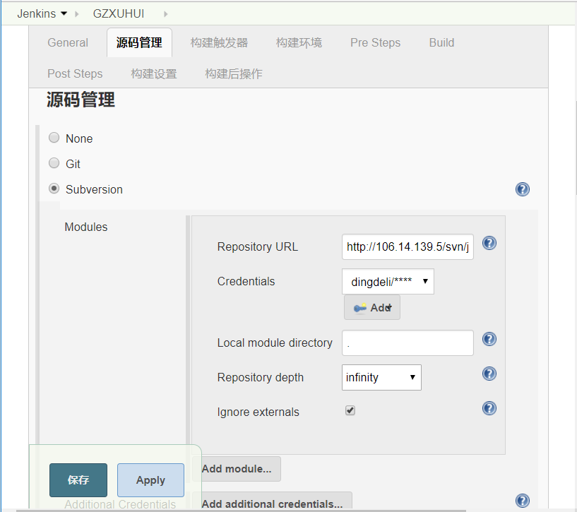
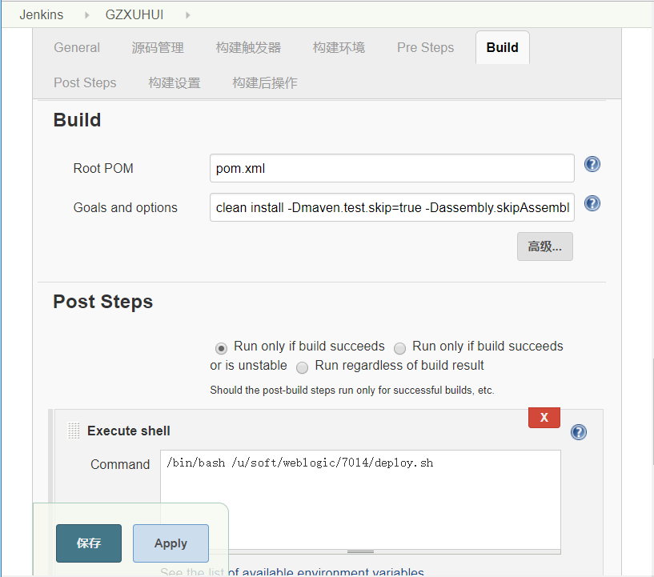
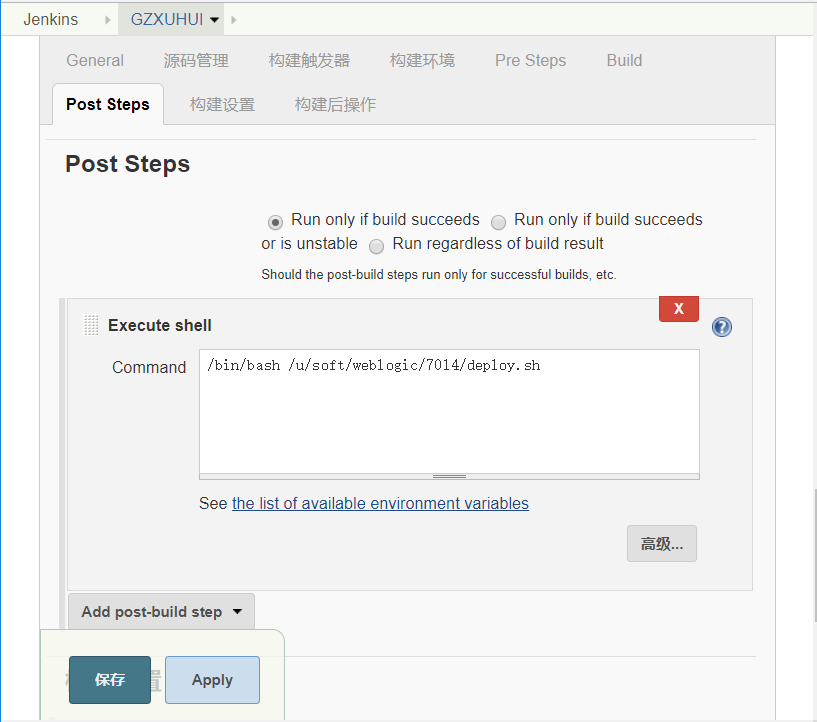
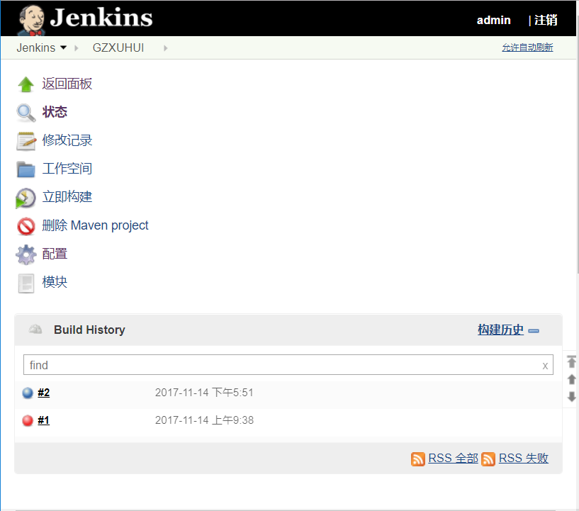

## 搭建 Jenkins + Maven + SVN 实现自动发布

### 安装 Tomcat

- 安装 JDK

    从 [Oracle 官网](http://www.oracle.com/technetwork/java/javase/downloads/index.html)下载 JDK，这里安装使用的是 `jdk-8u131-linux-x64.rpm`。

    安装： 
```BASH
    rpm -ivh jdk-8u131-linux-x64.rpm
```

- 设置 Java 环境变量
```BASH
    vim /etc/profile.d/java.sh
    export JAVA_HOME=/usr/java/jdk1.8.0_131
    export JRE_HOME=$JAVA_HOME/jre 
    export CLASSPATH=.:$JAVA_HOME/lib/dt.jar:$JAVA_HOME/lib/tools.jar:$JRE_HOME/lib:$CLASSPATH 
    export PATH=$JAVA_HOME/bin:$JRE_HOME/bin:$PATH 

    . /etc/profile.d/java.sh

    java -version
    java version "1.8.0_131"
    Java(TM) SE Runtime Environment (build 1.8.0_131-b11)
    Java HotSpot(TM) 64-Bit Server VM (build 25.131-b11, mixed mode)
```

- 安装 Tomcat

    从 [Tomcat 官网](https://tomcat.apache.org)下载 Tomcat 安装文件，这里安装使用的是 `apache-tomcat-8.5.23.tar.gz`。

    安装：
```BASH
    tar -zxvf apache-tomcat-8.5.23.tar.gz -C /u/home/
    cd /u/home/
    ln -sv apache-tomcat-8.5.23 tomcat
    `tomcat' -> `apache-tomcat-8.5.23'
    cd tomcat/
    ls -l
    total 112
    drwxr-x--- 2 root root  4096 Nov 13 10:14 bin
    drwx------ 2 root root  4096 Nov 13 10:20 conf
    drwxr-x--- 2 root root  4096 Nov 13 10:14 lib
    -rw-r----- 1 root root 57092 Sep 28 18:31 LICENSE
    drwxr-x--- 2 root root  4096 Sep 28 18:30 logs
    -rw-r----- 1 root root  1723 Sep 28 18:31 NOTICE
    -rw-r----- 1 root root  7064 Sep 28 18:31 RELEASE-NOTES
    -rw-r----- 1 root root 15946 Sep 28 18:31 RUNNING.txt
    drwxr-x--- 2 root root  4096 Nov 13 10:14 temp
    drwxr-x--- 7 root root  4096 Sep 28 18:30 webapps
    drwxr-x--- 2 root root  4096 Sep 28 18:30 work

```

- 设置 catalina 环境变量指明 Tomcat 的安装路径

```BASH
    vim /etc/profile.d/tomcat.sh
    export CATALINA_HOME=/usr/local/tomcat
    export PATH=$CATALINA_HOME/bin:$PATH

    . /etc/profile.d/tomcat.sh
```

### 在 Tomcat 上运行 Jenkins

- 设置 Jenkins 家目录的环境变量
```BASH
    vim /etc/profile.d/jenkins.sh
    export JENKINS_HOME=/u/home/jenkins
    . /etc/profile.d/jenkins.sh
```

- 安装 Jenkins。

    从 [Jenkins 官方网站](https://jenkins.io/)下载 Jenkins war 包，下载的包名为 Jenkins.war。将此 Jenkins.war 文件放置到 $CATALINA_HOME/webapps 目录下即可。

- 启动 Tomcat。
```BASH
    catalina.sh start
```

- 使用网页访问。

    Http://server/jenkins

- Follow the instructions to complete the installation.

### 另一种启动 Jenkins 的方法

默认下载的 Jenkins.war 包封装了一个类似 Tomcat 的 Java 容器 Winstone，
配置好 Java 环境变量后直接使用如下命令即可使用：
```BASH
    mkdir /var/log/jenkins //创建日志目录及日志文件。
    touch /var/log/jenkins/jenkins.log
    java -jar jenkins.war --daemon --httpPort=8080 logfile=/var/log/jenkins/jenkins.log   //启动 Jenkins 
```

### 设置 JDK

因为公司项目使用的是 JDK1.6，所以要单独再安装 JDK1.6；这里安装使用的是 `jdk-6u45-linux-x64.bin`（实际情况发现，因为 Tomcat 和 Jenkins 是使用 JDK1.8 启动的，这里再使用 JDK1.6 会报 `Unsupported major.minor version 51.0` 错误，取消 JDK1.6 的设置后即可恢复正常，所以这一步也可省略，不配置，默认使用系统环境变量指定的 JDK 。）

```BASH
    chmod +x jdk-6u45-linux-x64.bin
    ./jdk-6u45-linux-x64.bin

```

系统管理 -> Global Tool Configuration  



### 设置 Maven

公司项目使用的 Maven 版本是 Maven-3.0.3，这里使用 Jenkins 自动安装 Maven，选中要安装的版本即可。

系统管理 -> Global Tool Configuration



### 安装 Maven 插件

安装了 Maven 插件才能创建 Maven 项目。

系统管理 -> 管理插件 -> 可选插件 
搜索 maven



### 创建新的 Maven 项目

Jenkins -> 新建  

- 输入项目名称，选择‘构建一个maven项目’，单机‘OK’。



- 设置描述



- 设置源码管理  
```
    http://106.14.139.5/svn/java-develop/framework/trunk/GZ
```

记得设置登录 SVN 的凭证(Credentials)。



- 设置 Maven 编译命令
```
    clean install -Dmaven.test.skip=true -Dassembly.skipAssembly=true
```


- 设置 Post Steps

上面的所有步骤是用来编译项目，Post Steps 这里可使用脚本实现自动化发布编译好的应用。

选中 ‘Run only if build succeeds’，选择 ‘Execute shell’，输入要执行的命令即可。这里命令的意思是使用 bash 执行一个叫 deploy.sh 的脚本，脚本里的具体内容在下文给出。



- 保存

###  编写脚本实现自动化发布

- 设置免秘钥登录
- 编写测试脚本
```BASH
    #!/bin/bash

    # war 包目录
    export WARPATH=/u/soft/weblogic/7012

    # 备份目录
    export BACKPATH=/u/soft/weblogic/7012/backup/$(date +%F)

    # 编译的 war 包目录
    export DEPWARPATH=/u/home/jenkins/workspace/GZ/target

    # Weblogic 部署应用程序和模块目录
    export wlslib=/u/home/weblogic/Oracle/Middleware/Oracle_Home/wlserver/server/lib

    # 如果备份目录不存在，创建之
    [ -d "$BACKPATH" ] || mkdir -p $BACKPATH

    if [ ! -f "$WARPATH/GZ.war" ]; then
        cp $DEPWARPATH/GZ.war $WARPATH
    else 
        mv $WARPATH/GZ.war $BACKPATH/GZ_$(date +%H%M%S).war
        cp $DEPWARPATH/GZ.war $WARPATH
    fi

    if [ $? -eq 0 ]; then
        java -cp $wlslib/weblogic.jar:$wlslib/wlepool.jar:$wlslib/wleorb.jar weblogic.Deployer -adminurl t3://127.0.0.1:7012 -user weblogic -password xlsgrid123 -name GZ -targets AdminServer -deploy /u/soft/weblogic/7012/GZ.war
        echo "Deploy Success!"
    else
        echo "Deploy Failed!"
    fi

```


- 将脚本应用于 Jenkins

### 构建测试

- 选择‘立即构建’



- 在 Console Outpu 中查看构建日志信息。

## 完

###Reference
http://blog.csdn.net/zlxfogger/article/details/52768360  
https://jenkins.io/doc/pipeline/tour/getting-started/